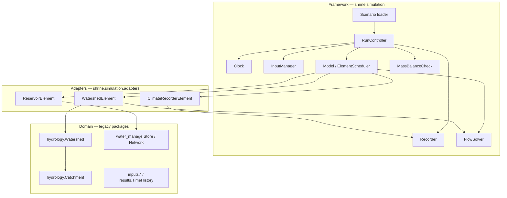
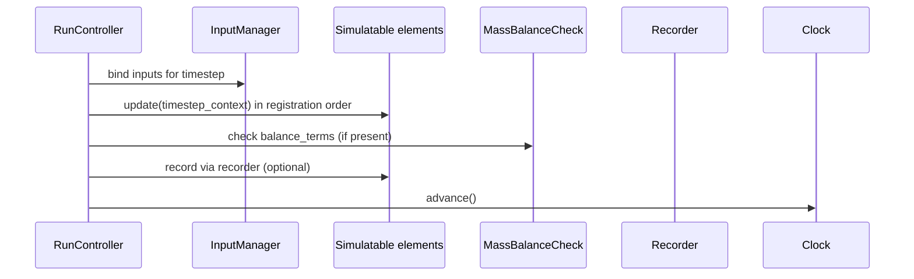
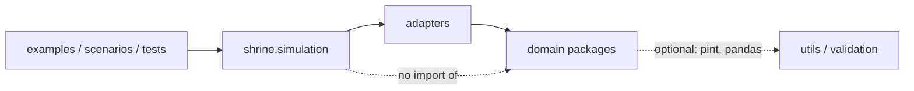
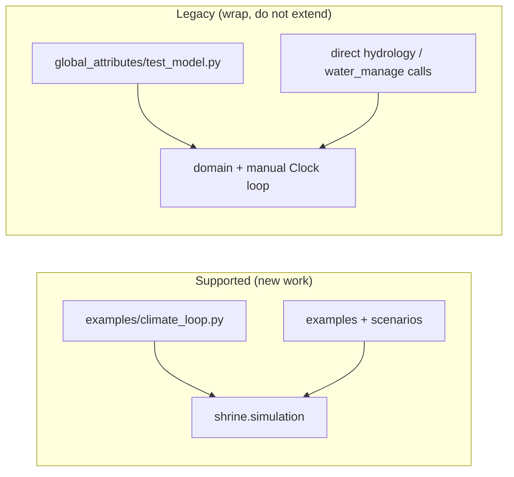

# SHRINE architecture

This page is published on the [documentation site](https://jlillywh.github.io/SHRINE/architecture/) (GitHub Pages). It describes how the **simulation framework**, **domain physics**, and **adapters** fit together.

New application code should target **`shrine.simulation`** only; legacy modules remain callable through adapters or scripts until fully wrapped.

Related:

- [Concepts](concepts.md) — short mental model before the diagrams below
- [First watershed tutorial](tutorial/first-watershed-model.md) — end-to-end supported path
- [Simulation framework requirements](simulation-framework-requirements.md) — requirements and phased delivery
- [Extending elements](extending-elements.md) — adding `Simulatable` elements and adapters
- [Architecture Decision Records](adr/README.md) — major design decisions (units, flow solver, protocols)
- [Modernization roadmap](modernization-roadmap.md) — migration checklist

---

## Three layers

| Layer | Responsibility | Does *not* |
|-------|----------------|------------|
| **Framework** (`shrine.simulation`) | Time, run loop, inputs, recording, flow dispatch, mass balance, scenarios, errors | Implement catchment/reservoir physics |
| **Adapters** (`shrine.simulation.adapters`, `elements.py`) | Thin `Simulatable` wrappers; translate framework context ↔ domain API | Own the simulation clock or global run loop |
| **Domain** (`hydrology/`, `water_manage/`, `inputs/`, `results/`, …) | Physics, networks, tables, legacy helpers; Phase 2 **protocols** (e.g. `RunoffModel`) | Advance time or enforce a common run contract (unless called directly in legacy scripts) |



---

## Timestep flow (framework-owned)

Only **`RunController`** advances the clock. Each timestep follows this order (see §7.0 in the requirements doc):



Adapters implement **`initialize` / `update` / `finalize`** and call into domain objects inside **`update`** (for example `Watershed.discharge`, `Store.update`). Domain code must not call `clock.advance()`.

---

## Package map

| Layer | Primary locations | Examples |
|-------|-------------------|----------|
| Framework | `src/shrine/simulation/` | `Model`, `RunController`, `Clock`, `InputManager`, `Recorder`, `NetworkXFlowSolver`, `scenario.py` |
| Adapters | `src/shrine/simulation/adapters/`, `elements.py` | `WatershedElement`, `ReservoirElement`, `ClimateRecorderElement` |
| Domain | `src/hydrology/`, `src/water_manage/`, `src/geometry/`, … | `Watershed`, `Catchment`, `Network`, `Store`, `TimeHistory` |
| Legacy shell | `src/global_attributes/` | `LegacyModel`, `LegacyClock` (deprecated; prefer framework types) |

**Graph ownership (D2):** the directed graph lives on the **domain** `Watershed` / `Network` object. The framework **`FlowSolver`** operates on that graph when an adapter requests a solve—it does not duplicate topology at `Model` level.

---

## Dependency direction



- **Framework → domain:** only through adapters (or explicit optional imports inside adapter modules).
- **Domain → framework:** avoided; keeps physics usable in notebooks and legacy scripts.
- **Application → framework:** `Model.register(...)`, `RunController.run()`, or `load_and_run(scenario)`.

---

## Legacy vs supported path



| Pattern | Status |
|---------|--------|
| `shrine.simulation.Model` + `RunController` + adapters | **Supported** |
| `examples/climate_loop.py`, scenario YAML/JSON | **Supported** |
| `global_attributes.Simulator` | **Removed** — import raises; use `RunController` |
| `global_attributes.LegacyModel` / `Model` | **Deprecated** |
| File I/O in `LegacyModel.__init__` | **Removed** (0.9) |

---

## Extension points

| Goal | Where to work |
|------|----------------|
| New physics with existing class | New adapter under `src/shrine/simulation/adapters/` |
| New physics from scratch | New class implementing `Simulatable` (`protocols.py`) |
| New input type | `InputProvider` in `inputs.py` |
| New output sink | `Recorder` or wrap via `results.TimeHistory` |
| Scenario-driven run | `scenario.py` + YAML/JSON |

See [extending-elements.md](extending-elements.md) for step-by-step patterns.

---

## Tests and examples

| Kind | Location |
|------|----------|
| Framework unit / acceptance tests | `tests/simulation/` |
| Domain contract tests | `tests/hydrology/`, `tests/water_manage/`, … |
| Runnable demos | `examples/` |

Run the canonical suite: `./scripts/run_tests.sh` or `pytest tests/` — see [Testing & CI](testing.md).

To surface deprecations during test runs:

```bash
pytest tests/simulation -W default::DeprecationWarning
```
