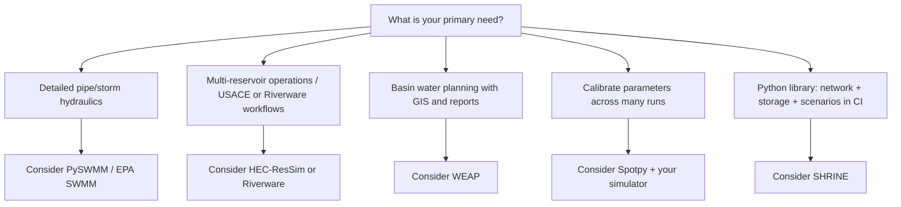

# How SHRINE compares to other tools

This note is **scope guidance**, not a competitive scorecard. SHRINE is an early-stage, **MIT-licensed** Python library focused on a **programmable simulation framework** (`shrine.simulation`) with legacy domain modules (hydrology, storage, networks) wrapped by adapters. Many tools below are mature products, desktop suites, or specialized engines with decades of use in operations and regulation.

**Use SHRINE when** you want Python-native composition, scenario-driven runs, explicit mass balance, and an open codebase you can extend.  
**Use something else when** you need certified 1D/2D hydraulics, a planning GUI, agency-standard reservoir system software, or turnkey calibration at production scale.

Related: [Architecture](architecture.md) · [API stability](api-stability.md) · [Modernization roadmap](modernization-roadmap.md)

---

## At a glance

| Tool / category | Primary role | SHRINE overlap | Main difference from SHRINE |
|-----------------|-------------|----------------|------------------------------|
| **[PySWMM](https://pyswmm.readthedocs.io/)** | Python API to **EPA SWMM** (stormwater, 1D hydraulics, LID) | Network flow, catchment runoff | SWMM is the regulatory-grade engine; SHRINE is not SWMM and does not solve full pipe/channel hydraulics |
| **[HEC-ResSim](https://www.hec.usace.army.mil/software/hec-ressim/)** | USACE **reservoir system** simulation & operating rules | `ReservoirElement`, storage mass balance | ResSim is the agency toolchain for multi-reservoir coordination, forecasts, and DSS workflows |
| **[Riverware](https://www.riverware.org/)** | **Rule-based** river/reservoir systems, priorities, optimization | Flow networks, reservoirs, rule-like releases | Riverware is a mature GUI + rule engine for operating policy; SHRINE has no equivalent rule IDE |
| **[WEAP](https://www.weap21.org/)** | **Water planning** (demand, supply, scenarios, reporting) | Scenarios, monthly inputs, basins | WEAP is an integrated planning application with GIS and stakeholder workflows; SHRINE is a developer library |
| **Modular hydrology libraries** (e.g. **[CMF](https://philippkraft.github.io/cmf/)**, gridded/GHM-style stacks) | Build **custom hydrologic models** from components | Catchment runoff, modular Python | CMF/GHMs target distributed physics and model assembly; SHRINE targets **orchestrated network + storage** runs via one framework loop |
| **[Spotpy](https://spotpy.readthedocs.io/)** | **Calibration / optimization** (SCE-UA, MCMC, …) | None (by design) | Spotpy wraps *any* model; it does not simulate hydrology. Complements SHRINE rather than replacing it |

!!! note "Roadmap label “GHMF”"
    The modernization roadmap uses **GHMF** as shorthand for **generic / gridded hydrologic modeling frameworks** (distributed or modular model construction), not a single commercial product. If you meant a specific package, please open an issue so we can link it explicitly.

---

## By tool

### PySWMM (EPA SWMM)

**What it is:** Python bindings to **EPA SWMM** — subcatchments, nodes, conduits, pumps, groundwater, water quality, LID, etc.

**Overlap with SHRINE:** Catchment runoff and directed graphs; both can represent “water moving through a network.”

**Honest gaps:**

- SHRINE does **not** embed SWMM’s 1D hydraulic solver, dynamic wave routing in pipes, or EPA’s validation history.
- SHRINE’s default watershed path uses **max-flow** on a domain graph, not Saint-Venant pipe hydraulics.

**When SHRINE is enough:** Conceptual twin-catchment basins, teaching, adapter experiments, integrated Python apps where you own the orchestration.

**When to prefer PySWMM:** Urban drainage, combined sewers, detailed conduit routing, or deliverables that must cite SWMM.

---

### HEC-ResSim

**What it is:** US Army Corps of Engineers software for **reservoir system simulation** — pools, passes, forecasts, operating plans, multiple projects.

**Overlap with SHRINE:** Storage elements, releases, mass balance, timestep-driven simulation.

**Honest gaps:**

- SHRINE offers **`ReservoirElement`** and legacy `water_manage` storage, not ResSim’s full **system operating plan** vocabulary, forecast ensembles, or HEC ecosystem integration.
- Operating rules in SHRINE are **code and scenario overrides**, not ResSim’s dedicated rule set editor.

**When SHRINE is enough:** Prototyping release logic in Python, coupling storage to a custom network, research scripts.

**When to prefer HEC-ResSim:** USACE or partner workflows, formal reservoir system studies, regulatory submissions tied to HEC tools.

---

### Riverware

**What it is:** University of Colorado **river basin modeling** — priority-based allocation, reservoirs, diversions, hydropower, often with optimization and a long GUI history.

**Overlap with SHRINE:** River networks, storage, timestep simulation, operating constraints expressed in code.

**Honest gaps:**

- No Riverware-style **priority rule solver** or Teacup-style visualization out of the box.
- SHRINE is **library-first**; Riverware is **modeler-first** with a dedicated user community and training.

**When SHRINE is enough:** Embedding basin logic in a larger Python system, custom elements, CI-tested scenario files.

**When to prefer Riverware:** Complex operating policies on major systems, established Riverware models, optimization studies in that environment.

---

### WEAP (Water Evaluation And Planning)

**What it is:** SEI’s **integrated water planning** platform — demands, supplies, infrastructure, climate scenarios, maps, and reports for planners.

**Overlap with SHRINE:** Named scenarios, climate inputs, multi-element water balance thinking.

**Honest gaps:**

- WEAP is a **standalone planning product** with GIS, data libraries, and non-programmer UX.
- SHRINE has **no** built-in demand-side planning modules, map UI, or WEAP’s scenario comparison workspace.

**When SHRINE is enough:** Developers building bespoke models, version-controlled scenarios in Git, pytest + CI.

**When to prefer WEAP:** Basin planning studies, stakeholder workshops, standard WEAP methodology and deliverables.

---

### Modular hydrology libraries (CMF and “GHMF”-style frameworks)

**What they are:** Toolkits to **assemble** hydrologic models from storages, fluxes, and solvers — often gridded or physically structured (e.g. **Catchment Modelling Framework**, community land-surface stacks).

**Overlap with SHRINE:** Python hydrology, catchment response, extensibility.

**Honest gaps:**

- SHRINE is **not** primarily a finite-volume or distributed grid engine; catchments are largely **lumped** legacy modules behind adapters.
- Framework emphasis is **RunController + adapters + scenarios**, not CMF-style hypothesis graphs.

**When SHRINE is enough:** Network-of-catchments + junction + storage problems with a single run loop and manifest.

**When to prefer CMF/GHMs:** Distributed hillslope/grid physics, glacio-hydrology, or building many alternative structural hypotheses in one toolkit.

---

### Spotpy (and other calibrators)

**What it is:** **SPOTPY** — algorithms (SCE-UA, DE, MCMC, …) and objective functions to **calibrate** external models.

**Overlap with SHRINE:** Both appear in Python hydrology workflows.

**Honest gaps:**

- Spotpy **does not simulate** water; SHRINE **does not ship** a calibration suite (reference scenarios in **3.10**; perf benchmark in **3.9**).
- You can wrap `RunController.run()` in a Spotpy `setup` class today, but that integration is **bring-your-own**.

**When to use together:** SHRINE simulates; Spotpy searches parameters. Same division as HYMOD + Spotpy in the Spotpy documentation.

---

## What SHRINE deliberately focuses on

| Strength | Detail |
|----------|--------|
| **Framework-first API** | `Model`, `RunController`, `Simulatable`, scenarios, structured errors |
| **Mass balance** | Per-timestep checks with `SimulationError` diagnostics |
| **Reproducibility** | Seeds, run manifest, scenario hash, golden tests |
| **Open source** | MIT License; editable install; CI (pytest, mypy, ruff, docs) |
| **Integration story** | Adapters bridge legacy `hydrology` / `water_manage` into one clock |

| Limitation (today) | Detail |
|--------------------|--------|
| **Maturity** | Alpha; packaging CI ready (**3.6** part 1); first PyPI release deferred (**3.6** part 2); legacy domain debt |
| **GUI** | None; examples and MkDocs only |
| **Hydraulics** | No SWMM-class 1D/2D engine |
| **Planning** | No WEAP-class demand planning or GIS workspace |
| **Operations** | No HEC-ResSim / Riverware rule IDE or certified DSS stack |
| **Calibration** | No bundled Spotpy-style optimizer (use Spotpy externally) |

---

## Decision sketch

---

## See also

- [First watershed tutorial](tutorial/first-watershed-model.md) — supported SHRINE path end-to-end
- [Scenarios](scenarios.md) — YAML/JSON inputs and overrides
- [Extending elements](extending-elements.md) — custom `Simulatable` types

*Last updated with roadmap item **3.5**. Corrections and links to specific “GHMF” products welcome via GitHub issues.*
