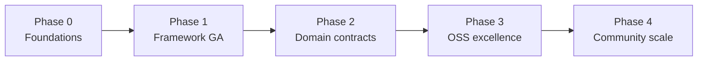

# SHRINE Modernization Roadmap

**SHRINE** — **S**imulation of **H**ydrology, **R**eservoirs, and **I**ntegrated **N**etwork **E**nvironment.

**Status:** Living document — strategic checklist  
**Audience:** Maintainers, contributors, water-resources engineers evaluating SHRINE  
**Last updated:** 2026-05-28  
**Related:** [simulation-framework-requirements.md](simulation-framework-requirements.md), [extending-elements.md](extending-elements.md), [testing.md](testing.md)

---

## 1. North star

> **SHRINE is a state-of-the-art, open-source Python library for integrated water-resources modeling** — calendar-driven, unit-aware, testable, and composable — with a clear framework boundary and domain modules that plug in through well-defined contracts.

### What “pythonic + object-oriented” means for SHRINE

| Principle | In practice |
|-----------|-------------|
| **Contracts over inheritance** | `Protocol` / ABCs at framework boundaries; shallow domain inheritance only where it earns its keep |
| **Composition** | `Model` + `RunController` + adapters; NetworkX for topology; Pandas/NumPy for series — not bespoke graph classes |
| **Explicit state** | Run context, timestep context, typed errors, reproducible seeds |
| **Encapsulation** | No string exceptions; no path concatenation with `\\`; no `setattr` overrides without validation |
| **Pragmatic physics** | Sacramento/AWBM may stay procedural *inside* a class; the *boundary* is still typed and testable |

### What we will not do

- Rewrite every hydrology routine as deep inheritance trees
- Wrap every NetworkX node in a custom class
- Block releases on 100% legacy test migration before framework value is proven
- Break public `shrine.simulation` APIs without deprecation cycles

---

## 2. Current baseline (2026)

| Layer | Maturity | Notes |
|-------|----------|-------|
| `src/shrine/simulation/` | **Strong** | Public API, scenarios, manifest, `RunSession`, 100+ framework tests |
| Legacy domain (`src/hydrology/`, `src/water_manage/`, …) | **Mixed** | Installable under `src/`; colocated `unittest` tests often stale (matplotlib, API drift) |
| Packaging | **Good** | `src/` layout; extras `dev`, `viz`, `hydrology` documented in README |
| Open-source polish | **Early** | GPL, docs site, CI; PyPI **packaging CI** done (**3.6** infra); **first PyPI upload deferred** until **3.8** + P1 quality gates |

### 2.1 Progress snapshot (2026-05-28)

| Phase | Done | Open (highest leverage) |
|-------|------|-------------------------|
| **0** | 0.1–0.13, 0.14–0.16 (**complete**) | — |
| **1** | 1.1–1.17 (**complete**) | Phase 1 exit criteria (examples, no LegacyModel path, CI) |
| **2** | 2.1–2.14 (**complete**) | Phase 2 exit criteria |
| **3** | **3.1**–**3.5**, **3.7**, **3.6** (packaging CI), **3.8**, **3.9** | **3.10**–**3.12** P1 → **3.6** first PyPI upload |
| **4** | — | Deferred |

**Phase 0 exit criteria (status):**

| Criterion | Status |
|-----------|--------|
| `pytest tests/` green on Linux/WSL without `PYTHONPATH=.` | **Met** — use `pip install -e ".[dev]"` (see [testing.md](testing.md)) |
| No string exceptions; no Windows-only paths in library code | **Met** (0.6–0.9); import-time unit load in `geometry/shape.py` remains (→ 1.12) |
| README: new code → `shrine.simulation` only | **Met** |

**Not in scope for Phase 0:** making `pytest src/hydrology/ …` green — colocated legacy tests need migration (**2.8**–**2.11**) and optional deps (`viz` for matplotlib).

---

## 3. Phased strategy (overview)

| Phase | Theme | Outcome |
|-------|--------|---------|
| **0** | Foundations | Safe repo, one import story, broken APIs fixed |
| **1** | Framework GA | `shrine.simulation` is the only supported run path |
| **2** | Domain contracts | Legacy modules implement clear boundaries |
| **3** | OSS excellence | CI, docs, packaging, units, benchmarks |
| **4** | Community scale | Plugins, translations, reference models, governance |

**Rule:** Finish Phase *n* exit criteria before starting *n+1* “nice to have” work.

---

## 4. Prioritized checklist

Use checkboxes in PRs / issues. **P0** = do first; **P1** = next quarter; **P2** = strategic; **P3** = when core is stable.

### Phase 0 — Foundations (4–8 weeks)

**Goal:** Trustworthy codebase; no foot-guns; clear “where to add code.”

#### P0 — Security & repo hygiene

- [x] **0.1** Confirm no secrets in history (`git log -S 'AIza'`, GitGuardian cleared) — verified 2026-05-26: `git-filter-repo` removed `data/apikey.txt` and `data_external/apikey.txt` from all refs; `7c383cc` no longer reachable; `file_class` force-pushed; pickaxe `-S AIza` only hits `docs/secrets-and-repo-hygiene.md` (example text, no key material). **You:** mark incident resolved in GitGuardian UI.
- [x] **0.2** Document secret handling in [secrets-and-repo-hygiene.md](secrets-and-repo-hygiene.md); link from README and [testing.md](testing.md)
- [x] **0.3** Add pre-commit hook or CI secret scan — `.github/workflows/secrets.yml` (gitleaks), `.pre-commit-config.yaml`, `.gitleaks.toml`, `scripts/scan_secrets.sh`

#### P0 — Fix broken contracts

- [x] **0.4** Align `Store.update()` and `Reservoir.calc_overflow()` — `Store.update(inflow=None, request=None)`; `calc_overflow` calls `update(inflow=0.0, request=q)`
- [x] **0.5** Fix `ShrineObject.get_instance_count()` to return `int` (`src/global_attributes/shrine_object.py`)
- [x] **0.6** Replace `raise("...")` with proper exceptions in `src/data/fileman.py`

#### P0 — Portability

- [x] **0.7** Refactor `data/fileman.py` to `pathlib.Path`; remove `'\\'` concatenation
- [x] **0.8** Remove hard-coded `C:\Users\...` from tests; use `tmp_path` / repo-relative fixtures
- [x] **0.9** Audit `global_attributes/model.py` paths; mark deprecated or delete file I/O from `__init__`

#### P1 — Packaging & imports

- [x] **0.10** Add `__init__.py` to domain packages under `src/` (also `global_attributes`, `testing` for setuptools discovery)
- [x] **0.11** Expand `pyproject.toml` `packages.find` so `pip install -e .` installs domain packages
- [x] **0.12** Adopt `src/` layout; import policy in [testing.md](testing.md) (no repo-root `PYTHONPATH`)
- [x] **0.13** Pin optional extras: add `hydrology = [...]`; document `viz` (already in `pyproject.toml`) and `dev` install matrix in README

#### P1 — Naming clarity

- [x] **0.14** Rename legacy `global_attributes.Model` → `LegacyModel` (re-export with deprecation warning)
- [x] **0.15** Rename legacy `global_attributes.Clock` → `LegacyClock` (same)
- [x] **0.16** Add `docs/architecture.md` diagram: framework vs domain vs adapters

**Phase 0 exit criteria** — see §2.1 table; **Phase 0 checklist complete** (2026-05-28).

---

### Phase 1 — Framework general availability (8–16 weeks)

**Goal:** Any new model is built only with `shrine.simulation`; legacy is wrapped, not extended.

#### P0 — Framework hardening

- [x] **1.1** Publish stable public API in `src/shrine/simulation/__init__.py`; document in README
- [x] **1.2** Add API stability policy (semver; deprecation warnings for one minor release)
- [x] **1.3** Scenario validation: reject unknown keys / invalid units at load time (`scenario.py`)
- [x] **1.4** Run manifest on `RunResult` (git commit, scenario hash, seed, timestamps, element list)
- [x] **1.5** Optional `with RunSession(controller):` context manager wrapping begin/step/complete

#### P0 — Deprecate legacy entry points

- [x] **1.6** Mark `src/global_attributes/simulator.py` deprecated; remove or quarantine broken prototype
- [x] **1.7** Remove root `main.py` (legacy geometry demo); use `examples/` scripts as the only documented entry points
- [x] **1.8** Move `src/hydrology/streamflow.py` to `examples/nwis_streamflow.py` (NWIS one-off; requires `.[hydrology]`)

#### P1 — Adapters & elements

- [x] **1.9** Adapter for `Catchment` / rational runoff (minimal second element type)
- [x] **1.10** Document adapter **authoring** checklist in [extending-elements.md](extending-elements.md) *(§15 pre-flight + implementation; §16 testing)*
- [x] **1.11** `StorageLike` protocol documented in extending-elements; reservoir adapter uses it consistently *(§14 in extending-elements; validated reservoir overrides; `register_reservoir`)*

#### P1 — Units at the boundary

- [x] **1.12** Load `src/data/shrine_units.json` once; inject `UnitRegistry` via `RunContext` (not import-time load in `src/geometry/shape.py` — partial: package-relative path only)
- [x] **1.13** Validate input/output units in `Recorder` metadata
- [x] **1.14** Fail fast when adapter returns bare floats without unit metadata (configurable strict mode)

#### P1 — Testing

- [x] **1.15** Golden-run test: fixed scenario JSON → hash of `result.outputs` (regression guard)
- [x] **1.16** Property test or fuzz-light: mass balance holds for `SimpleStore` + constant inputs
- [x] **1.17** CI workflow: `pip install -e ".[dev]"` + `pytest tests/`, coverage ≥80% on `shrine` (`.github/workflows/test.yml` + Codecov)

**Phase 1 exit criteria**

| Criterion | Status |
|-----------|--------|
| Three documented examples run headless after `pip install -e ".[dev]"` | **Met** — README: `climate_loop.py`, `watershed_run.py`, `catchment_run.py`, `run_from_scenario.py` |
| No recommended path uses `LegacyModel` / manual loops in `global_attributes/` | **Met** — README points to `examples/` + `shrine.simulation` |
| CI green on every PR (`pytest` required check) | **Met** — `.github/workflows/test.yml`; enable branch protection on `master` in GitHub settings |

---

### Phase 2 — Domain contracts (3–6 months)

**Goal:** Legacy physics stays, but every module has typed boundaries and enums instead of magic strings.

#### P0 — Domain protocols (lightweight)

- [x] **2.1** Define `RunoffModel` protocol: `compute(precip, et) -> Quantity` in `src/hydrology/protocols.py` *(see [hydrology-contracts.md](hydrology-contracts.md); `Rational` / `Awbm` + `tests/hydrology/test_runoff_protocol.py`)*
- [x] **2.2** Refactor `Catchment` to accept `RunoffModel` instance (keep string factory for backward compat, deprecated)
- [x] **2.3** Add `RunoffMethod` enum (`SIMPLE`, `AWBM`, …) (`hydrology/enums.py`; default on `Catchment` / `CatchmentElement`)
- [x] **2.4** Define `StorageElement` protocol shared by `Store` / `Reservoir` / simulation adapters (`water_manage/protocols.py`; `StorageLike` alias in shrine)

#### P1 — Graph model clarity

- [x] **2.5** Typed node payload dataclass (`CatchmentNode`, `JunctionNode`, `SinkNode`) stored in `graph.nodes[n]["payload"]` (`hydrology/graph_nodes.py`)
- [x] **2.6** Single source of truth: catchments live on graph nodes, not parallel dict (migrate `Watershed.catchments`)
- [x] **2.7** `node_type` as enum, not raw string in `flow_network.py` (`GraphNodeType` in `hydrology/enums.py`; `get_node_type` / `set_node_type` in `graph_nodes.py`)

#### P1 — Encapsulation pass (module by module)

| Module | Tasks |
|--------|--------|
| `src/water_manage/` | Fix update/spill API; `__repr__` on Store/Reservoir; allocator keys as enum |
| `src/hydrology/` | Sacramento state → dataclasses; WGEN boundaries typed |
| `src/inputs/` | `TimeSeries` without matplotlib import at module level; lazy viz *(blocks colocated tests)* |
| `src/geometry/` | Remove import-time unit load; shapes return `Quantity` *(overlaps **1.12**) |
| `src/data/` | `FileManager` returns `Path`; typed exceptions *(pathlib done in 0.7)* |

#### P2 — Test migration

- [x] **2.8** Move `src/hydrology/test_*.py` → `tests/hydrology/` (pytest style; fix `test_junction.py` API drift)
- [x] **2.9** Move `src/water_manage/test_*.py` → `tests/water_manage/`
- [x] **2.10** Shared fixtures in `tests/conftest.py` for watershed, reservoir, clock *(partial: `short_clock`, `two_catchment_watershed`, `SimpleStore` exist — extend for domain parity)*
- [x] **2.11** Mark colocated `unittest` files deprecated; delete when parity reached *(hydrology/water_manage deleted in 2.8–2.9; legacy Model/Simulator moved to `tests/global_attributes/`; remaining `src/*/test_*.py` warn via `testing.colocated`)*

#### P2 — Type checking

- [x] **2.12** Add `mypy` (or `pyright`) config; strict on `src/shrine/`, basic on domain (`[tool.mypy]` in `pyproject.toml`, CI ``typecheck.yml``)
- [x] **2.13** `from __future__ import annotations` in all domain modules (`scripts/add_future_annotations.py`; 80 files under `src/{hydrology,water_manage,…}/`)
- [x] **2.14** Ruff (or flake8) + format with `ruff format` in CI (`[tool.ruff]` in `pyproject.toml`, CI ``lint.yml`` — lint `src/shrine` + `tests`; format check on `src/`, `tests/`, `examples/`, `scripts/`)

**Phase 2 exit criteria**

- `Catchment` and `Watershed` usable only through typed APIs in new tests
- mypy clean on `src/shrine/` (strict, CI); domain uses `from __future__ import annotations` (**2.13**) with basic mypy profile until types are tightened

---

### Phase 3 — Open-source excellence (6–12 months)

**Goal:** A global engineer can discover, install, learn, and trust SHRINE in one afternoon.

#### P0 — Documentation site

- [x] **3.1** MkDocs Material (or Sphinx) site: Install, Quickstart, Concepts, API reference (`mkdocs.yml`, `docs/` nav, `.github/workflows/docs.yml`, `pip install -e ".[docs]"`)
- [x] **3.2** Auto-generate API docs from `shrine.simulation` docstrings (`scripts/gen_api_reference.py`, `docs/api/autogen/`, mkdocstrings in CI)
- [x] **3.3** Tutorial: “Build your first watershed model” (scenario + plot) (`docs/tutorial/first-watershed-model.md`, `examples/tutorial_watershed.py`, `scenarios/tutorial_watershed.yaml`)
- [x] **3.4** Architecture page on doc site (framework / domain / adapters) — [architecture.md](architecture.md) under **Get started** in `mkdocs.yml`; Mermaid diagrams; linked from home, README, concepts, tutorial
- [x] **3.5** Comparison note: how SHRINE differs from PySWMM, HEC-ResSim, Riverware, WEAP, modular hydrology frameworks (GHMF), Spotpy, etc. ([comparison.md](comparison.md))

#### P0 — Packaging foundation

- [x] **3.7** Versioning policy (SemVer); changelog (`CHANGELOG.md`, Keep a Changelog) — [releases.md](releases.md)
- [x] **3.6** *(part 1 — infrastructure)* PyPI-ready packaging: `pyproject.toml` metadata, `package.yml` cross-platform smoke install, `publish.yml`, `docs/pypi.md`, `scripts/build_package.sh` — **no first upload yet** ([pypi.md](pypi.md))

#### P1 — Engineering quality

- [x] **3.8** Install & extras documentation: source path (`pip install -e ".[dev,viz,hydrology]"`, venv / PEP 668), wheel vs clone-for-`scenarios/`; README + [install.md](install.md) aligned for future `pip install shrine[…]` — **do before first PyPI upload**
- [x] **3.9** Benchmark scenario (performance regression in CI, optional threshold) — `scenarios/benchmark/benchmark_watershed.yaml`, `tests/benchmark/`, `scripts/update_benchmark_baseline.py`
- [ ] **3.10** Reference model library: `scenarios/reference/` (synthetic basin, published benchmark if available)
- [ ] **3.11** Contributor guide: `CONTRIBUTING.md`, `CODE_OF_CONDUCT.md`, issue templates
- [ ] **3.12** ADR folder: `docs/adr/` for major decisions (units, flow solver, protocols)

#### P1 — Interoperability

- [ ] **3.13** Export run results: CSV, NetCDF, or Parquet with metadata
- [ ] **3.14** Import time series: CSV with column mapping documented
- [ ] **3.15** Optional GIS export (GeoPackage) for network topology — `viz` extra

#### P2 — License & governance

- [ ] **3.16** Confirm GPL v3 fits contributor expectations; or document why not LGPL/MIT for libs
- [ ] **3.17** `GOVERNANCE.md` (maintainer, release manager, lazy consensus)
- [ ] **3.18** Security policy: `SECURITY.md` (reporting, supported versions)

#### P2 — Public PyPI release *(deferred until stable)*

**Gate before part 2:** **3.8** (install docs), **3.10** (reference scenarios), **3.11** (contributor guide); optional TestPyPI dry run.

- [ ] **3.6** *(part 2 — first upload)* Publish **`shrine`** to PyPI (`shrine-wrm` / `shrine-water` fallbacks in [pypi.md](pypi.md)); trusted publisher; tag + GitHub Release triggers `publish.yml` — **not before beta readiness**

**Phase 3 exit criteria**

- GitHub Pages docs live; tutorial + API reference discoverable
- Packaging CI: wheel/sdist build + cross-platform smoke install (**3.6** part 1) — **met**
- **3.6** part 2 (public `pip install shrine` on PyPI): deferred until **3.8** + P1 quality gates
- When **3.6** part 2 ships: PyPI install works on Windows, macOS, Linux (smoke test in CI)

---

### Phase 4 — Community & ecosystem (ongoing)

**Goal:** Third parties extend SHRINE without forking core.

- [ ] **4.1** Plugin entry point: `shrine.elements` for third-party `Simulatable` implementations
- [ ] **4.2** Template repo: `shrine-element-cookiecutter`
- [ ] **4.3** Discussions / Discord / matrix channel linked from README
- [ ] **4.4** “Good first issue” and `help wanted` labels; quarterly release train
- [ ] **4.5** Translation of docs (Spanish, Portuguese, French — common in water sector)
- [ ] **4.6** Workshop notebook (Binder link) for universities
- [ ] **4.7** Citation file (`CITATION.cff`) for academic users
- [ ] **4.8** Seek alignment with OWASP / water-data standards (OGC, WaterML) where practical

---

## 5. Priority matrix (impact × effort)

| ID | Task | Impact | Effort | Phase |
|----|------|--------|--------|-------|
| 0.4–0.6 | Fix broken APIs | High | Low | 0 |
| 0.7–0.9 | pathlib + tests | High | Medium | 0 |
| 1.17 | CI on every PR | High | Low | 1 |
| 1.12–1.14 | Units at boundary | High | Medium | 1 |
| 0.14–0.16 | Legacy rename | Medium | Low | 0 |
| 2.1–2.3 | RunoffModel protocol | High | Medium | 2 |
| 2.5–2.7 | Graph payload model | High | High | 2 |
| 3.1–3.4 | Doc site | High | Medium | 3 |
| 3.6 (infra) | Packaging CI | High | Medium | 3 — **done** |
| 3.8 | Install docs | High | Low | 3 — **done** |
| 3.9 | Benchmark scenario | Medium | Low | 3 — **done** |
| 3.6 (publish) | First PyPI upload | High | Low | 3 — **deferred** |
| 4.1 | Plugin entry points | Medium | High | 4 |

**Do first (May 2026):** **1.17** (pytest CI) → **1.15** (golden-run) → **2.8** (domain test migration).

**Completed since last matrix edit:** Phase 0 (0.1–0.13, 0.14–0.16), 1.1–1.6.

**Defer until Phase 2+:** deep Sacramento refactor, full graph migration (**2.5**–**2.7**), plugin system (**4.1**).

---

## 6. Definition of “state of the art” (measurable)

| Metric | Target (18 months) |
|--------|---------------------|
| Framework test coverage | ≥85% `shrine.simulation` |
| CI | Green on 3.10–3.12, Linux + Windows |
| Install | `pip install shrine` &lt;2 min on fresh venv |
| Time to first run | &lt;15 min following Quickstart |
| API stability | SemVer; deprecation warnings documented — [api-stability.md](api-stability.md); [CHANGELOG.md](https://github.com/jlillywh/SHRINE/blob/master/CHANGELOG.md) |
| Adapters | ≥4 element types (watershed, reservoir, catchment, custom example) |
| Docs | Published site + API reference + 3 tutorials |
| Issues | Critical bugs &lt;7 days median response (aspirational) |

---

## 7. Suggested issue labels (GitHub)

| Label | Use for |
|-------|---------|
| `phase-0` … `phase-4` | Roadmap phase |
| `P0` / `P1` / `P2` | Priority within phase |
| `framework` | `src/shrine/simulation` |
| `domain` | hydrology, water_manage, … |
| `tech-debt` | Legacy cleanup |
| `good-first-issue` | Docs, tests, small fixes |
| `breaking` | Needs migration note |

---

## 8. Anti-patterns to flag in code review

- New features on `LegacyModel` / `global_attributes.Simulator` (Simulator removed — use `RunController`)
- String method dispatch where an enum or protocol exists
- Bare `float` across framework boundary without unit metadata
- `type(x) == str` instead of `isinstance(x, str)`
- Module-level I/O or plotting imports
- Paths with `\\` or hard-coded user directories
- `setattr(element, key, value)` in scenarios without allowlist

---

## 9. How to use this document

1. **Pick one phase** — do not spread across all phases at once.
2. **Open GitHub issues** from checklist IDs (e.g. `roadmap-0.7`).
3. **Link PRs** to issues; check boxes when merged.
4. **Review quarterly** — adjust P0/P1 based on contributors and user feedback.

For simulation-specific requirements, continue to use [simulation-framework-requirements.md](simulation-framework-requirements.md). This roadmap is the **whole-project** path to a pythonic, object-oriented, world-class OSS codebase.

---

## 10. Quick reference — file ownership

All library code under **`src/`** (import names unchanged: `shrine`, `hydrology`, …).

| Concern | Canonical location |
|---------|-------------------|
| Run lifecycle | `src/shrine/simulation/run_controller.py` |
| Element contract | `src/shrine/simulation/protocols.py` |
| Model registry | `src/shrine/simulation/model.py` |
| Legacy deprecation | `src/global_attributes/` → shrink over time |
| New hydrology | `src/hydrology/` + adapter in `src/shrine/simulation/adapters/` |
| New storage / ops | `src/water_manage/` + adapter |
| Examples | `examples/`, `scenarios/` (repo root) |
| Tests (target) | `tests/` only (pytest); legacy colocated tests → migrate from `src/*/` |

---

*Contributions to this roadmap: propose edits via PR; major direction changes should add an ADR.*
