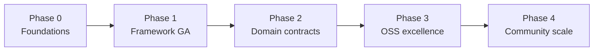

# Aegis Modernization Roadmap

**Status:** Living document — strategic checklist  
**Audience:** Maintainers, contributors, water-resources engineers evaluating Aegis  
**Last updated:** 2026-05-26  
**Related:** [simulation-framework-requirements.md](simulation-framework-requirements.md), [extending-elements.md](extending-elements.md), [testing.md](testing.md)

---

## 1. North star

> **Aegis is a state-of-the-art, open-source Python library for integrated water-resources modeling** — calendar-driven, unit-aware, testable, and composable — with a clear framework boundary and domain modules that plug in through well-defined contracts.

### What “pythonic + object-oriented” means for Aegis

| Principle | In practice |
|-----------|-------------|
| **Contracts over inheritance** | `Protocol` / ABCs at framework boundaries; shallow domain inheritance only where it earns its keep |
| **Composition** | `Model` + `RunController` + adapters; NetworkX for topology; Pandas/NumPy for series — not bespoke graph classes |
| **Explicit state** | Run context, timestep context, typed errors, reproducible seeds |
| **Encapsulation** | No string exceptions; no path concatenation with `\\`; no `setattr` overrides without validation |
| **Pragmatic physics** | Sacramento/AWBM may stay procedural *inside* a class; the *boundary* is still typed and testable |

### What we will not do

- Rewrite every hydrology routine as deep inheritance trees
- Wrap every NetworkX node in a custom class
- Block releases on 100% legacy test migration before framework value is proven
- Break public `aegis.simulation` APIs without deprecation cycles

---

## 2. Current baseline (2026)

| Layer | Maturity | Notes |
|-------|----------|-------|
| `aegis/simulation/` | **Strong** | Protocols, dataclasses, scenarios, mass balance, pytest |
| Legacy domain (`hydrology/`, `water_manage/`, …) | **Mixed** | Classes exist; weak polymorphism, string dispatch, path/typing debt |
| Packaging | **Partial** | `pip install -e .` installs `aegis*` only; domain on `PYTHONPATH` |
| Open-source polish | **Early** | GPL, README, examples; needs CI badges, CONTRIBUTING, API docs |

---

## 3. Phased strategy (overview)

| Phase | Theme | Outcome |
|-------|--------|---------|
| **0** | Foundations | Safe repo, one import story, broken APIs fixed |
| **1** | Framework GA | `aegis.simulation` is the only supported run path |
| **2** | Domain contracts | Legacy modules implement clear boundaries |
| **3** | OSS excellence | CI, docs, packaging, units, benchmarks |
| **4** | Community scale | Plugins, translations, reference models, governance |

**Rule:** Finish Phase *n* exit criteria before starting *n+1* “nice to have” work.

---

## 4. Prioritized checklist

Use checkboxes in PRs / issues. **P0** = do first; **P1** = next quarter; **P2** = strategic; **P3** = when core is stable.

### Phase 0 — Foundations (4–8 weeks)

**Goal:** Trustworthy codebase; no foot-guns; clear “where to add code.”

#### P0 — Security & repo hygiene

- [x] **0.1** Confirm no secrets in history (`git log -S 'AIza'`, GitGuardian cleared) — verified 2026-05-26: `git-filter-repo` removed `data/apikey.txt` and `data_external/apikey.txt` from all refs; `7c383cc` no longer reachable; `file_class` force-pushed; pickaxe `-S AIza` only hits `docs/secrets-and-repo-hygiene.md` (example text, no key material). **You:** mark incident resolved in GitGuardian UI.
- [x] **0.2** Document secret handling in [secrets-and-repo-hygiene.md](secrets-and-repo-hygiene.md); link from README and [testing.md](testing.md)
- [ ] **0.3** Add pre-commit hook or CI secret scan (e.g. `gitleaks`, `trufflehog`)

#### P0 — Fix broken contracts

- [ ] **0.4** Align `Store.update()` and `Reservoir.calc_overflow()` (`water_manage/store.py`, `reservoir.py`)
- [ ] **0.5** Fix `Aegis.get_instance_count()` to return `int` (`global_attributes/aegis.py`)
- [ ] **0.6** Replace `raise("...")` with proper exceptions in `data/fileman.py`

#### P0 — Portability

- [ ] **0.7** Refactor `data/fileman.py` to `pathlib.Path`; remove `'\\'` concatenation
- [ ] **0.8** Remove hard-coded `C:\Users\...` from tests; use `tmp_path` / repo-relative fixtures
- [ ] **0.9** Audit `global_attributes/model.py` paths; mark deprecated or delete file I/O from `__init__`

#### P1 — Packaging & imports

- [ ] **0.10** Add `__init__.py` to `hydrology`, `water_manage`, `geometry`, `inputs`, `data`, `results`, `hydraulics`, `numerical`, `controllers`, `utils`
- [ ] **0.11** Expand `pyproject.toml` `packages.find` so `pip install -e .` installs domain packages
- [ ] **0.12** Adopt `src/` layout *or* document flat layout with explicit `pythonpath` policy in [testing.md](testing.md)
- [ ] **0.13** Pin optional extras: `[project.optional-dependencies] hydrology = [...]`, `viz = [...]`

#### P1 — Naming clarity

- [ ] **0.14** Rename legacy `global_attributes.Model` → `LegacyModel` (re-export with deprecation warning)
- [ ] **0.15** Rename legacy `global_attributes.Clock` → `LegacyClock` (same)
- [ ] **0.16** Add `docs/architecture.md` diagram: framework vs domain vs adapters

**Phase 0 exit criteria**

- `pytest tests/` green on Linux/WSL without manual `PYTHONPATH` hacks
- No string exceptions; no Windows-only paths in library code
- README states: **new code → `aegis.simulation` only**

---

### Phase 1 — Framework general availability (8–16 weeks)

**Goal:** Any new model is built only with `aegis.simulation`; legacy is wrapped, not extended.

#### P0 — Framework hardening

- [ ] **1.1** Publish stable public API in `aegis/simulation/__init__.py`; document in README
- [ ] **1.2** Add API stability policy (semver; deprecation warnings for one minor release)
- [ ] **1.3** Scenario validation: reject unknown keys / invalid units at load time (`scenario.py`)
- [ ] **1.4** Run manifest on `RunResult` (git commit, scenario hash, seed, timestamps, element list)
- [ ] **1.5** Optional `with RunSession(controller):` context manager wrapping begin/step/complete

#### P0 — Deprecate legacy entry points

- [ ] **1.6** Mark `global_attributes/simulator.py` deprecated; remove or quarantine broken prototype
- [ ] **1.7** Redirect `main.py` to an `examples/` script or minimal framework demo
- [ ] **1.8** Move `hydrology/streamflow.py` to `examples/` or `scripts/` (NWIS one-off)

#### P1 — Adapters & elements

- [ ] **1.9** Adapter for `Catchment` / rational runoff (minimal second element type)
- [ ] **1.10** Document adapter checklist in [extending-elements.md](extending-elements.md)
- [ ] **1.11** `StorageLike` protocol documented; reservoir adapter uses it consistently

#### P1 — Units at the boundary

- [ ] **1.12** Load `data/aegis_units.json` once; inject `UnitRegistry` via `RunContext` (not module import in `geometry/shape.py`)
- [ ] **1.13** Validate input/output units in `Recorder` metadata
- [ ] **1.14** Fail fast when adapter returns bare floats without unit metadata (configurable strict mode)

#### P1 — Testing

- [ ] **1.15** Golden-run test: fixed scenario JSON → hash of `result.outputs` (regression guard)
- [ ] **1.16** Property test or fuzz-light: mass balance holds for `SimpleStore` + constant inputs
- [ ] **1.17** CI workflow: `pytest tests/`, coverage ≥80% on `aegis` (GitHub Actions)

**Phase 1 exit criteria**

- Three documented examples run headless from `pip install -e ".[dev]"`
- No recommended path uses `LegacyModel` / manual loops in `global_attributes/`
- CI green on every PR to `master`

---

### Phase 2 — Domain contracts (3–6 months)

**Goal:** Legacy physics stays, but every module has typed boundaries and enums instead of magic strings.

#### P0 — Domain protocols (lightweight)

- [ ] **2.1** Define `RunoffModel` protocol: `compute(precip, et) -> Quantity` in `hydrology/protocols.py`
- [ ] **2.2** Refactor `Catchment` to accept `RunoffModel` instance (keep string factory for backward compat, deprecated)
- [ ] **2.3** Add `RunoffMethod` enum (`SIMPLE`, `AWBM`, …)
- [ ] **2.4** Define `StorageElement` protocol shared by `Store` / `Reservoir` / simulation adapters

#### P1 — Graph model clarity

- [ ] **2.5** Typed node payload dataclass (`CatchmentNode`, `JunctionNode`, `SinkNode`) stored in `graph.nodes[n]["payload"]`
- [ ] **2.6** Single source of truth: catchments live on graph nodes, not parallel dict (migrate `Watershed.catchments`)
- [ ] **2.7** `node_type` as enum, not raw string in `flow_network.py`

#### P1 — Encapsulation pass (module by module)

| Module | Tasks |
|--------|--------|
| `water_manage/` | Fix update/spill API; `__repr__` on Store/Reservoir; allocator keys as enum |
| `hydrology/` | Sacramento state → dataclasses; WGEN boundaries typed |
| `inputs/` | `TimeSeries` without matplotlib import at module level; lazy viz |
| `geometry/` | Remove import-time unit load; shapes return `Quantity` |
| `data/` | `FileManager` returns `Path`; typed exceptions |

#### P2 — Test migration

- [ ] **2.8** Move `hydrology/test_*.py` → `tests/hydrology/` (pytest style)
- [ ] **2.9** Move `water_manage/test_*.py` → `tests/water_manage/`
- [ ] **2.10** Shared fixtures in `tests/conftest.py` for watershed, reservoir, clock
- [ ] **2.11** Mark colocated `unittest` files deprecated; delete when parity reached

#### P2 — Type checking

- [ ] **2.12** Add `mypy` (or `pyright`) config; strict on `aegis/`, basic on domain
- [ ] **2.13** `from __future__ import annotations` in all domain modules
- [ ] **2.14** Ruff (or flake8) + format with `ruff format` in CI

**Phase 2 exit criteria**

- `Catchment` and `Watershed` usable only through typed APIs in new tests
- mypy clean on `aegis/`; &lt;N known ignores on domain (documented in `pyproject.toml`)

---

### Phase 3 — Open-source excellence (6–12 months)

**Goal:** A global engineer can discover, install, learn, and trust Aegis in one afternoon.

#### P0 — Documentation site

- [ ] **3.1** MkDocs Material (or Sphinx) site: Install, Quickstart, Concepts, API reference
- [ ] **3.2** Auto-generate API docs from `aegis.simulation` docstrings
- [ ] **3.3** Tutorial: “Build your first watershed model” (scenario + plot)
- [ ] **3.4** Architecture page (framework / domain / adapters) with mermaid diagrams
- [ ] **3.5** Comparison note: how Aegis differs from PySWMM, GHMF, Spotpy, etc. (honest scope)

#### P0 — Packaging & releases

- [ ] **3.6** Publish to PyPI (`aegis-wrm` or `aegis-water` if name taken)
- [ ] **3.7** Versioning policy (SemVer); changelog (`CHANGELOG.md`, Keep a Changelog)
- [ ] **3.8** `pip install aegis[hydrology,viz,dev]` documented

#### P1 — Engineering quality

- [ ] **3.9** Benchmark scenario (performance regression in CI, optional threshold)
- [ ] **3.10** Reference model library: `scenarios/reference/` (synthetic basin, published benchmark if available)
- [ ] **3.11** Contributor guide: `CONTRIBUTING.md`, `CODE_OF_CONDUCT.md`, issue templates
- [ ] **3.12** ADR folder: `docs/adr/` for major decisions (units, flow solver, protocols)

#### P1 — Interoperability

- [ ] **3.13** Export run results: CSV, NetCDF, or Parquet with metadata
- [ ] **3.14** Import time series: CSV with column mapping documented
- [ ] **3.15** Optional GIS export (GeoPackage) for network topology — `viz` extra

#### P2 — License & governance

- [ ] **3.16** Confirm GPL v3 fits contributor expectations; or document why not LGPL/MIT for libs
- [ ] **3.17** `GOVERNANCE.md` (maintainer, release manager, lazy consensus)
- [ ] **3.18** Security policy: `SECURITY.md` (reporting, supported versions)

**Phase 3 exit criteria**

- PyPI install works on Windows, macOS, Linux (smoke test in CI)
- ReadTheDocs (or GitHub Pages) live; Google finds “Aegis water resources Python”

---

### Phase 4 — Community & ecosystem (ongoing)

**Goal:** Third parties extend Aegis without forking core.

- [ ] **4.1** Plugin entry point: `aegis.elements` for third-party `Simulatable` implementations
- [ ] **4.2** Template repo: `aegis-element-cookiecutter`
- [ ] **4.3** Discussions / Discord / matrix channel linked from README
- [ ] **4.4** “Good first issue” and `help wanted` labels; quarterly release train
- [ ] **4.5** Translation of docs (Spanish, Portuguese, French — common in water sector)
- [ ] **4.6** Workshop notebook (Binder link) for universities
- [ ] **4.7** Citation file (`CITATION.cff`) for academic users
- [ ] **4.8** Seek alignment with OWASP / water-data standards (OGC, WaterML) where practical

---

## 5. Priority matrix (impact × effort)

| ID | Task | Impact | Effort | Phase |
|----|------|--------|--------|-------|
| 0.4–0.6 | Fix broken APIs | High | Low | 0 |
| 0.7–0.9 | pathlib + tests | High | Medium | 0 |
| 1.17 | CI on every PR | High | Low | 1 |
| 1.12–1.14 | Units at boundary | High | Medium | 1 |
| 0.14–0.16 | Legacy rename | Medium | Low | 0 |
| 2.1–2.3 | RunoffModel protocol | High | Medium | 2 |
| 2.5–2.7 | Graph payload model | High | High | 2 |
| 3.1–3.4 | Doc site | High | Medium | 3 |
| 3.6 | PyPI | High | Medium | 3 |
| 4.1 | Plugin entry points | Medium | High | 4 |

**Do first:** 0.4–0.9, 1.17, 0.10–0.11, 1.1–1.2.

**Defer until Phase 2+:** deep Sacramento refactor, full graph migration, plugin system.

---

## 6. Definition of “state of the art” (measurable)

| Metric | Target (18 months) |
|--------|---------------------|
| Framework test coverage | ≥85% `aegis.simulation` |
| CI | Green on 3.10–3.12, Linux + Windows |
| Install | `pip install aegis` &lt;2 min on fresh venv |
| Time to first run | &lt;15 min following Quickstart |
| API stability | SemVer; deprecation warnings documented |
| Adapters | ≥4 element types (watershed, reservoir, catchment, custom example) |
| Docs | Published site + API reference + 3 tutorials |
| Issues | Critical bugs &lt;7 days median response (aspirational) |

---

## 7. Suggested issue labels (GitHub)

| Label | Use for |
|-------|---------|
| `phase-0` … `phase-4` | Roadmap phase |
| `P0` / `P1` / `P2` | Priority within phase |
| `framework` | `aegis/simulation` |
| `domain` | hydrology, water_manage, … |
| `tech-debt` | Legacy cleanup |
| `good-first-issue` | Docs, tests, small fixes |
| `breaking` | Needs migration note |

---

## 8. Anti-patterns to flag in code review

- New features on `LegacyModel` / `global_attributes.Simulator`
- String method dispatch where an enum or protocol exists
- Bare `float` across framework boundary without unit metadata
- `type(x) == str` instead of `isinstance(x, str)`
- Module-level I/O or plotting imports
- Paths with `\\` or hard-coded user directories
- `setattr(element, key, value)` in scenarios without allowlist

---

## 9. How to use this document

1. **Pick one phase** — do not spread across all phases at once.
2. **Open GitHub issues** from checklist IDs (e.g. `roadmap-0.7`).
3. **Link PRs** to issues; check boxes when merged.
4. **Review quarterly** — adjust P0/P1 based on contributors and user feedback.

For simulation-specific requirements, continue to use [simulation-framework-requirements.md](simulation-framework-requirements.md). This roadmap is the **whole-project** path to a pythonic, object-oriented, world-class OSS codebase.

---

## 10. Quick reference — file ownership

| Concern | Canonical location |
|---------|-------------------|
| Run lifecycle | `aegis/simulation/run_controller.py` |
| Element contract | `aegis/simulation/protocols.py` |
| Model registry | `aegis/simulation/model.py` |
| Legacy deprecation | `global_attributes/` → shrink over time |
| New hydrology | `hydrology/` + adapter in `aegis/simulation/adapters/` |
| New storage / ops | `water_manage/` + adapter |
| Examples | `examples/`, `scenarios/` |
| Tests (target) | `tests/` only (pytest) |

---

*Contributions to this roadmap: propose edits via PR; major direction changes should add an ADR.*
