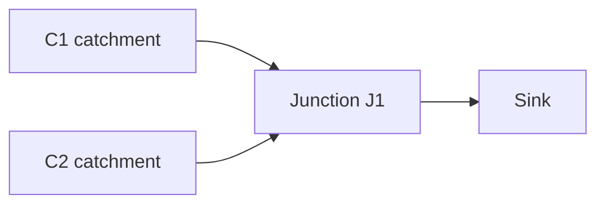

# Build your first watershed model

This tutorial walks through a complete **twin-catchment watershed**: define topology in Python, drive the run with a **scenario file**, inspect tabular outputs, and **plot** outflow vs time.

**Time:** ~30 minutes  
**Prerequisites:** [Install](../install.md) from a Git clone with the `viz` extra for plotting:

```bash
bash scripts/bootstrap_venv.sh
.venv/bin/python3 -m pip install -e ".[dev,viz]"
```

**Runnable script:** [`examples/tutorial_watershed.py`](https://github.com/jlillywh/SHRINE/blob/master/examples/tutorial_watershed.py)  
**Bundled scenario:** [`scenarios/tutorial_watershed.yaml`](https://github.com/jlillywh/SHRINE/blob/master/scenarios/tutorial_watershed.yaml)

---

## What you will build



Each day the framework:

1. Reads **precipitation** and **evaporation** from the scenario
2. Computes catchment runoff and updates graph capacities
3. **Routes** flow through the junction to the sink (NetworkX max-flow)
4. Records **`basin.outflow`** and **`basin.total_supply`** on every timestep

---

## Step 1 — Model topology (Python)

Physical layout (catchments, junctions, links) stays in code. Create `my_watershed.py` or use the repo example:

```python
from hydrology.watershed import Watershed
from shrine.simulation import Model, WatershedElement


def build_tutorial_model():
    ws = Watershed()
    ws.add_junction("J1", "sink")
    ws.link_catchment("C1", "J1")
    ws.link_catchment("C2", "J1")

    model = Model(name="TutorialBasin")
    model.register_watershed("basin", WatershedElement(ws, element_id="basin"))
    return model
```

`element_id="basin"` prefixes recorded columns (`basin.outflow`, …).

---

## Step 2 — Scenario file (climate + clock)

Runs settings live in YAML or JSON under `scenarios/`. The tutorial file uses **monthly precipitation** and **constant evaporation** for January–March 2019:

```yaml
# scenarios/tutorial_watershed.yaml (excerpt)
name: tutorial_watershed
seed: 42

clock:
  start_date: "1/1/2019"
  end_date: "3/31/2019"
  time_step: "1 days"

inputs:
  precipitation:
    type: monthly
    values:
      January: 8.0
      February: 6.0
      March: 10.0
      # … remaining months omitted here; see repo file
  evaporation:
    type: constant
    value: 1.0
```

Because precipitation is monthly, **outflow steps down in February and up in March** — useful when you plot the series later.

Full scenario format: [Scenarios](../scenarios.md).

---

## Step 3 — Run the simulation

From the repo root:

```bash
python examples/tutorial_watershed.py
```

Or in a notebook/script:

```python
from pathlib import Path

from shrine.simulation import load_and_run

from my_watershed import build_tutorial_model  # or import from examples

scenario = Path("scenarios/tutorial_watershed.yaml")
result = load_and_run(build_tutorial_model, scenario)

assert result.success
print(result.metadata["status"])       # success
print(result.metadata["scenario_name"])  # tutorial_watershed
```

`load_and_run` applies the scenario clock, binds inputs, and returns a **`RunResult`**.

---

## Step 4 — Inspect outputs

`result.outputs` is a wide **pandas** DataFrame — one row per timestep:

```python
print(result.outputs[["basin.outflow", "basin.total_supply"]].head())
```

| Column | Meaning |
|--------|---------|
| `basin.total_supply` | Sum of catchment runoff before routing |
| `basin.outflow` | Flow routed to the sink (mass balance pairs these) |

Run metadata and provenance live on `result.metadata` and `result.manifest` (git commit, scenario hash, element list).

---

## Step 5 — Plot results

The tutorial script plots supply vs routed outflow:

```bash
python examples/tutorial_watershed.py --no-show --output tutorial_plot.png
```

Programmatically:

```python
from examples.tutorial_watershed import plot_watershed_results

plot_watershed_results(result, output=Path("tutorial_plot.png"), show=False)
```

You should see **three plateaus** (Jan / Feb / Mar) matching monthly precipitation. Supply and outflow should track closely when routing conserves mass.

!!! tip "Headless environments"
    Use `--no-show --output plot.png` or set `MPLBACKEND=Agg` in CI and servers without a display.

---

## Try variations

| Change | What to edit |
|--------|----------------|
| Wetter spring | Raise `March` (or `April`) in the scenario |
| Shorter run | Set `end_date` to `"1/31/2019"` |
| Constant climate | Replace `precipitation` with `precipitation: 10.0` (shorthand constant) |
| Reproducible stochastic inputs | Add `seed` and a `stochastic` input — see [Scenarios](../scenarios.md) |

Re-run after each change; scenario hash in `result.manifest` updates when inputs change.

---

## What this tutorial does *not* cover

| Topic | Where to go next |
|-------|------------------|
| CSV climate files | [Import CSV time series](../import-csv-timeseries.md) — `type: csv` scenarios or `load_csv_timeseries()` in code |
| Reservoir operating rules | [ReservoirElement](../api/autogen/elements.md) + scenario `overrides` |
| Custom elements | [Extending elements](../extending-elements.md) |
| Single-timestep debugging | [Step debugging](../step-debugging.md) |

---

## Full command recap

```bash
cd SHRINE
bash scripts/bootstrap_venv.sh
.venv/bin/python3 -m pip install -e ".[dev,viz]"
.venv/bin/python3 examples/tutorial_watershed.py scenarios/tutorial_watershed.yaml \
  --no-show --output tutorial_plot.png
```

Next: [Architecture](../architecture.md) (framework vs domain) or [Extending elements](../extending-elements.md) (add your own `Simulatable`).
